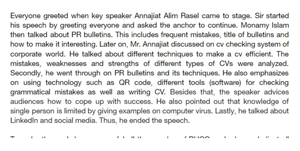
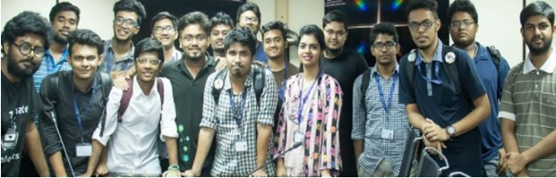
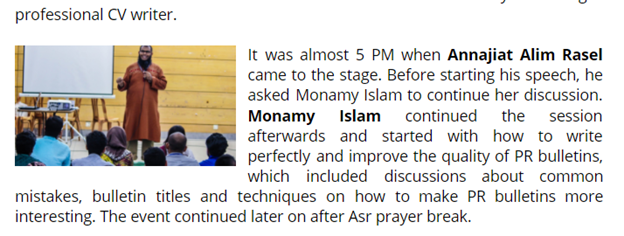
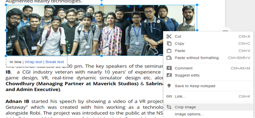
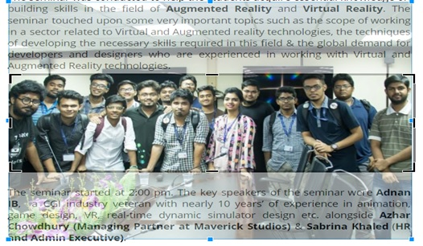

# Editing/Writing Guidelines For BUCC PR

> Preparing a written material for publication by correcting, condensing, or otherwise modifying it is called Editing.
>
> -Wikipedia

There are some basic Rules for PR Writing/Editing.
Please check those out.

## Basic Rules

1. **Platform:** We will use [Google Docs](https://docs.google.com/)

2. **Font:** The font type for the main text should always be **Open Sans** and the font size is `12 pt.` for main text and `18 pt.` for headline.

    | Font | Heading | Main Text |
    |------| :----------: | :---------: |
    |**Type**| `Open-Sans` | `Open-Sans`|
    |**Size**| `18 pt`. | `12 pt.` |

3. **Format of Headline:** The headline should be brief and to the point. It should be **bolded** and **underlined** as well.

4. **Length:** The text of the PR should not exceed 1.5 pages and the total PR (including the picture) should not exceed `2` pages.

5. **Paragraph size and subject** Each paragraph should not be more than 5-6 lines at most and each Paragraph should focus on only a single topic as to ensure that the readers are able to easily read and understand the information.

   **Wrong**
   
   
   
   **Right**
   
   

## General writing style

- The writer should always prevent him/herself from using unnecessarily complex words or sentences. The array of words used should maintain a fine balance between readability and professionalism. They should not be too difficult as to force the reader to open up a dictionary or too simple as to seem childish and immature.

- Sentences should not be longer than a single line or 1 and a ½ line at best. In cases where long sentences are difficult to avoid, they should be broken down by commas.

- And obviously, try to avoid being poetic and Exclamation marks are to be avoided at all cost 
  
  **Bad Example:** 
  > The unprejudiced aspiration of the workshop at hand was to broach the perplexing abstraction of communal entrepreneurship; leadership skills surrounding the idea of technological machineries and enhancing the competence of being able to outstand in the various stratums of Information and Technology to the participants of the event.

  **Good Example:** 
  > The core objective of the workshop was to introduce the concepts of social entrepreneurship, tech leadership and the techniques of excelling in various sectors of ICT to the students and participants of the event.

## Bolding Rules

BRAC University Computer Club, time, date, venue, event name, name of important speakers should be bolded only when encountered for the first time.

Example:
> The **BUCC** (BRAC University Computer Club) holds an excellent record when it comes to organizing a wide range of highly effective workshops under the supervision of the Directors of Event Management, **Humayan Kabir** and **Md. Monirujjaman Moon.**
>
> One of the best examples would be the workshop that was held on understanding the usage of  **Google Local Guides**, title **“Google Map Up”,** which was held on the **6th of July, 2017** at **UB40302**.
>
> The event was inaugurated at 5:00 PM by Md. Monirujjaman Moon with an inspiring speech and the distribution of goodies from Google.

## Type of Photo

When it comes to adding pictures to a PR, the most important thing to keep in mind is to crop out any unnecessary distractions. The photo should only show the participants of the event and the logo/banner of the event if possible.

Alternatively, if there are not group photos, then a good picture of one of the main speaker would suffice.

**Wrong** 

**Right** 

## Placement of Photos in the PR

Regardless of the type of the picture, the placement should always be at the beginning of the PR. However, the placement will vary slightly based on whether it is a group photo or a photo of the speaker.

- If it’s a group photo, then it should be placed carefully between two paragraphs as such
    
- Alternatively, if the picture only consists of the speaker, then it should be moved towards the edge of a paragraph as shown below. Keep in mind that the size of the photo has been significantly reduced as well.
    

## Volunteer List:

A paragraph thanking the volunteers of the event should always be kept at the end of the PR. All of the names are to be bolded. The list of Volunteers should be collected from the members of HR and if possible. The names are to be included in separate lists in the last paragraph such as:

> Special thanks goes to the senior executives “**Farhan Ahmed, Jamius Siam”** for “Writing everything”, also “**Jamius Alim, Sardar Motaleb Haque**” are to be thanked for “Helping others”**

## Additional tips 

If you are using Google Docs for the first time, then you might not be aware that it is possible to keep track of the changes in Google Doc. To check the history, **simply go the file > version history > see version history.** A menu will pop up where you will be able to check all of the previous edits made.

Another cool thing to know about Google Doc is that you can actually crop the pictures within the Doc itself, instead of using another third party software.

To do that, simply Right Click the picture and select crop image.

It will give you a selection tool using which you will be able to crop the picture with ease.

## PR Writing System

Since we are consistently trying to ensure that everything inside the PR department is being carried out in a systematic and efficient way, the following course of action is to be followed by anyone who might be supervising the PR of any given event.

- The senior executive in charge of the PR will create a Google Doc and provide it to the writers.
- If only 1 PR member attended the event, then the whole PR will be written by Him/Her. Alternatively, if 2+ members attended the event, then it is the responsibility of the senior executive to ensure that the written PR is a collaborative effort. Meaning, the writers themselves should divide the parts of the PR amongst themselves and write accordingly.
- The moment the Google Doc has been opened, [**Jannatul Ferdous Mim**](https://www.facebook.com/jannatul.fedrousmim/) (`jannatulferdousmim@gmail.com`), [**Anindo Masiat**](https://www.facebook.com/Masiat.Anindo/) (`shababmasiat@gmail.com`) and [**Abrar Ur Rahman**](https://www.facebook.com/aur.ishmam/) (`ishmam000@gmail.com`) are to be invited immediately as they will constantly be monitoring the progress of the Senior Executive in charge as well as the writers.
- Once the PR is complete, a preliminary editing is to be done by the writers themselves under the Senior Executive in charge. Afterwards, The Senior Executive in charge will do another check and pass it on to the Assistant Directors/Directors.
